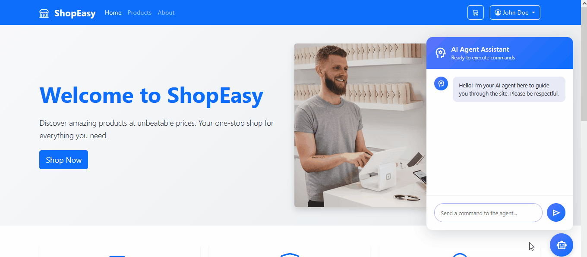
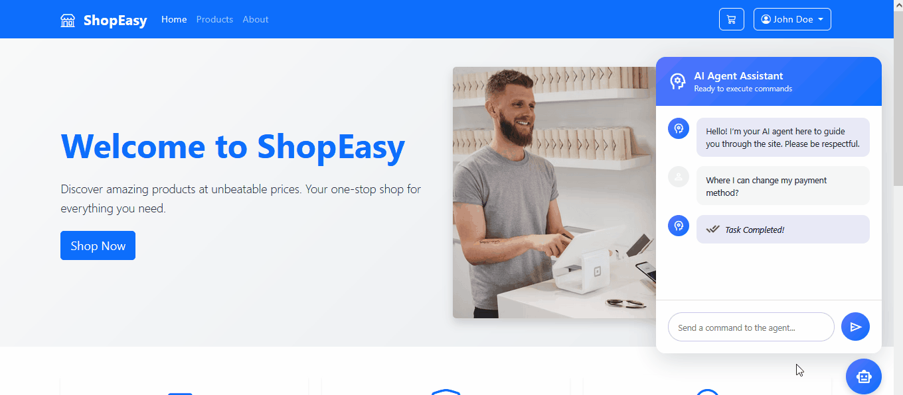

# 🤖 Devency AI Assistant

**A seamless, AI-powered tour on your site—without a single line of code!**

**Built by Devency**

## ✨ What It Does

Our AI Assistant enables your users to ask regular questions like:

> "How do I turn off SMS notifications?"

—and leads them directly through your site. Whether it's highlighting buttons or taking them step by step, the assistant does the thinking, so your visitors don't have to.

## 🔍 Key Benefits

- **Effortless Integration**
  Drop it into any website or web business within minutes—no coding expertise required.

- **Full Customization**
  Create your own appearance and placement: chat bubble, sidebar, or whatever fashion suits you.

- **Fast, Reliable Responses**
  Powered by the latest AI technologies to provide answers within a couple of seconds.

- **Visual Guidance**
Rather than jargon, your users' on-screen cues and reminders to act are presented.

- **Multi-Language Support**
  Supports nearly 95% of global languages—communicate with your visitors in their terms.

- **Lightweight & Low Overhead**
  Designed to be extremely lightweight so it will not slow down your site.

## 🚀 See It Live

Test the demo now:
👉 https://agent.demo.devency.net

> "Where I can change my payment methods?"

> "can you search for laptops?"

> Obviously those are dumb questions I mean who can't search for "laptops" 🤷‍♂️. These are just for demonstration

## 🔒 Closed‑Source & Demo‑Only

This is a completely proprietary project. The only access is through our live demo—no downloads, no code access.

## 💼 Pricing

Straightforward monthly plan tied to your site's activity—intentionally more cost-effective than other AI solution companies. Receive enterprise-level guidance without enterprise-level expense.

## 📈 Roadmap

- Improved context‑memory for continuous sessions
- Branding options for custom colors, icons, and fonts
- Detailed usage analytics dashboard
- Business integrations and service-level guarantees

## 🤝 Let's Work Together

Need to add a useful AI guide to your site?
Reach out to us for a tailored integration plan:

- 🌐 https://devency.net/contact
- ✉️ info@devency.net

## 🏷️ Badges

*Thank you for exploring our project!* 🚀
